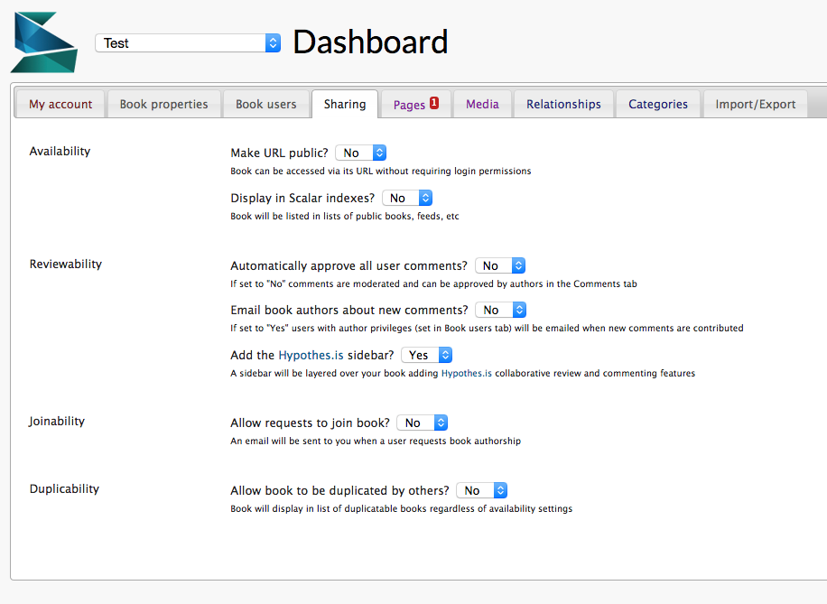
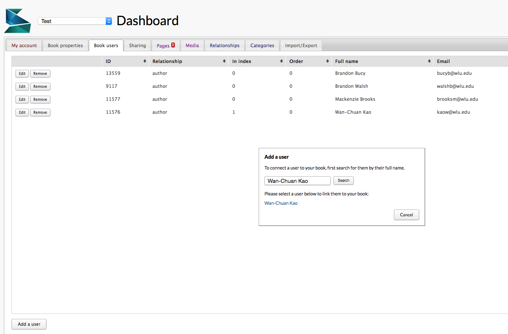

# Scalar Tutorial with SoundCiteJS integration


## What is Scalar? 
"[Scalar](http://scalar.usc.edu/) is a free, open source publishing platform that’s designed to make it easy for authors to write long-form, born-digital scholarship online. Scalar enables users to assemble media from multiple sources and juxtapose them with their own writing in a variety of ways, with minimal technical expertise required. Scalar also gives authors tools to structure essay- and book-length works in ways that take advantage of the unique capabilities of digital writing, including nested, recursive, and non-linear formats. The platform also supports collaborative authoring and reader commentary."

Created by the Alliance for Networking Visual Culture at the University of Southern California. 

## Examples
* [WRIT 100 Demo Scalar Book](http://scalar.usc.edu/works/wck-writ100/)
* [Complex TV](http://scalar.usc.edu/works/complex-television/index)
* [Pathfinders](http://scalar.usc.edu/works/pathfinders/index)
* [Making Roots](http://makingroots.net/anvc/making-roots/index)

## What do I need to know about Scalar?
* Every piece of content in Scalar constitutes a "page." This can be confusing if you're used to working with Wordpress or another content managmement system where you have separate content types (pages, posts, comments). 
* You can change the way your page is structured with the "Layout" menu while editing a page. 
* Scalar is very media-friendly. You can import and embed media from other source (like YouTube), but you can also upload your own media 
* Scalar has built in visualizations accessible by the compass icon in the top left corner. Users can use these visualizations to explore the book, or you can use them to keep track of your books's structure.
* To add items to your Table of Contents, start in the Dashboard. The "Book Properties" tab has a section for adding and arranging Table of Contents items.

## User's Guide
* [Scalar 2 User's Guide](http://scalar.usc.edu/works/guide2/index)
* [Scalar 2 Quickstarts](http://scalar.usc.edu/works/guide2/quickstarts)

### Sharing Settings
To keep your Scalar book private, select "No" for the options on this page. 



### Adding Users to your Book
Search for the full name of your professor to add Prof. Kao to your Scalar book. If you would like Brandon Bucy or Mackenzie Brooks to help you troubleshoot any issues, add them as well. 



## SoundCiteJS
[SoundCiteJS](http://soundcite.knightlab.com/) is a tool created by the Knight Lab at Northwestern University to embed audio in text. SoundCite enables you to unite text and audio in the same space, rather than separating them into blocks of content. 

### Setting Up Scalar for SoundCite
1. Create a new page for your essay. Use the "new page button" or plus sign icon in the top right corner. 
2. Before pasting in your essay, click on the "Source" button. 
3. Paste the following in the box:
```<link href='https://cdn.knightlab.com/libs/soundcite/latest/css/player.css' rel='stylesheet' type='text/css'><script type='text/javascript' src='https://cdn.knightlab.com/libs/soundcite/latest/js/soundcite.min.js'></script>``` 
4. Now paste the text of your essay. You can unselect "Source" to return to the normal view of your text. 
5. In the "Styling" section of your new page, choose  the CSS option. 
6. Page in the following and save:
 ```span.soundcite-loaded {display: inline}``` 
7. Now your page is ready to accept the audio clips. In Step 3, you added a reference to the Javascript and CSS files that make SoundCite work. In Step 6, you added a line of CSS that helps the audio player display inline with the rest of test (rather than as a separate paragraph.) 


### Creating your SoundCite Audio
1. To create a URL for your audio clip, upload it as media to Scalar. If your audio clip is larger than 2MB, it must be uploaded to SoundCloud. 
2. From the "Import" icon in the top right corner, choose "Import Local Media File."
3. Give your audio clip a title and description. Upload to the /media folder. 
4. Your media file should now be listed in the Media tab of the Dashboard. (Remember you can access the Dashboard with the wrench icon in the top right corner.)
5. Right click or control click on the Filename of your audio clip and choose "Copy Link Location."
6. On the [SoundCiteJS](http://soundcite.knightlab.com/) page, paste in this URL into the box of Step 1. Press Load.
7. Select the Start and End points of the clip if necessary. Paste in the text of your essay that corresponds with the audio clip in the "Link text" box. Click Create clip.
8. An embed code should appear on the page. Copy this code. 
9. Return to your essay page and select the "Source" option again. 
10. Select the text you wish to turn into a SoundCite audio clips. Paste in the embed code. 
11. Save and view your new page!


